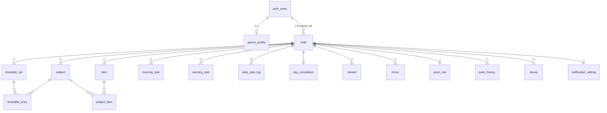

# クラウド同期設計（Supabase）

## 現状

Supabaseプロジェクトが未作成のため、このディレクトリには **スキーマ定義（`schema.sql`）のみ** を先に用意しています。
プロジェクトを作成し、SQL Editorで `schema.sql` を実行したら、Project URLとanon keyを教えてください。
そこから実際の同期コード（`@supabase/supabase-js` 連携・ログイン画面・sync engine）を実装します。

認証は最初はメール・パスワードのみ。Apple/Googleサインインは後日追加します。

## ER図（概要）

## 同期方式

- **オフラインファースト**: 画面は常にSQLite（ローカルキャッシュ）を読み書きする。Supabaseへの反映はバックグラウンドで行う。
- **last-write-wins**: 各テーブルに `updated_at` を持ち、push/pull時に新しい方を採用する。
- **論理削除**: `deleted_at` を立てるソフトデリート方式。物理削除すると「削除されたこと」自体が他端末に伝わらないため。
- **同期ループ**（実装予定）:
  1. アプリ起動時 & オンライン復帰時に、ローカルの `last_synced_at` 以降にSupabase側で更新された行をpull
  2. ローカルの `dirty`（未送信）行をpush
  3. 同じ行が両側で変わっていた場合は `updated_at` が新しい方を採用し、負けた側の変更はローカル履歴に残さず上書き
- **将来の拡張**:
  - 家族共有（パパ・ママ招待）→ `family_member(parent_id, invited_email, role)` テーブルを追加し、RLSポリシーを「自分がparent_id、または招待されているfamily_member」に拡張するだけで対応可能
  - 写真付き持ち物・添付画像 → 現状 `image_uri` はテキストで保持しているため、Supabase Storageの署名付きURLに差し替えるだけでスキーマ変更不要
  - Firebaseへの切り替え → Repositoryパターンにより、`db/repositories/*` の実装を差し替えるだけで画面側のコードは無変更

## Repositoryパターンの方針

既存の `src/db/repositories/*.ts` は関数ベースのRepositoryパターンをすでに採用済み。
今後は各Repositoryに:

- `sqliteXxxRepository.ts`（現行のexpo-sqlite実装、そのまま）
- `supabaseXxxRepository.ts`（新規、Supabase実装）

を用意し、`src/db/repositories/index.ts` でどちらを使うか切り替える1箇所のスイッチ（オンライン同期が有効かどうかの設定値）を設ける。
画面・store・feature層は現行のRepository関数シグネチャを呼ぶだけなので変更不要。
